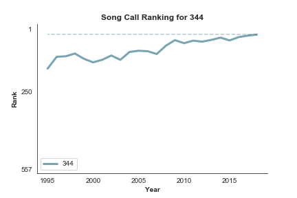

# Fasola Analysis (or FasolAnalysis, if you will)

A bored Sunday becomes some silly data analysis.

For those who are unfamiliar, shape-note signing is an early-American singing communal, hymnody-based singing tradition. Other people have written more eloquently than I will about it, but the long and short of it is that groups of people (sometimes religious, sometimes secular) get together to sing songs from a book full of music, the most popular of which is called The Sacred Harp, which contains 557 songs. Singers join together in a "hollow square", with the four vocal parts singing inwards towards one another, singing just for the joy of singing rather than to practice for a performance. Songs are sight-read or sung from memory, depending on the singer's familiarity with the given tune.

[These data](https://fasola.org/minutes/stats/?c=2018&s=b "Fasola: Historical Song Use") are compiled by the good folks over at fasola.org, who compile minutes from sings all through the world. They say they make the raw data available upon request, but A) I'm only seeing that now and B) I needed practice writing a web-scraper, so I just pulled them directly from the website itself.

This repository is more of a gesture than any sort of real rigorous analysis. Hopefully I'll continue working on it, but I would also encourage others to join me; feel free to send pull requests.

## Files
* **get_data.py** A scraper to pull the relevant data from fasola.org.
* **analysis.py** Some plotting stuff.

## Results
We can plot the popularity of a single song's popularity through the years:

We may also plot the way that several songs have changed over time:

Or we can make a gif of the popularity of a selection of songs through time.

## To Do
* If I can get the raw data, geographic stuff would be awesome to play with.
* Any sort of actual analysis: which songs co-vary, which songs have had the most dramatic changes, etc.
* Make the group of songs an object with plotting methods maybe?
* Right now, everything is geared for ranking rather than sing-counts. Make sure things are robust to both.
