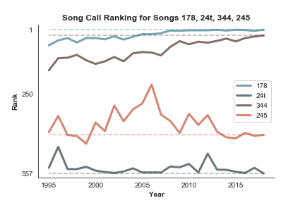
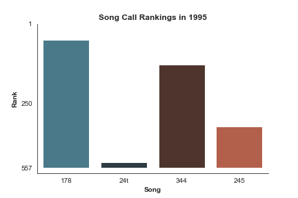
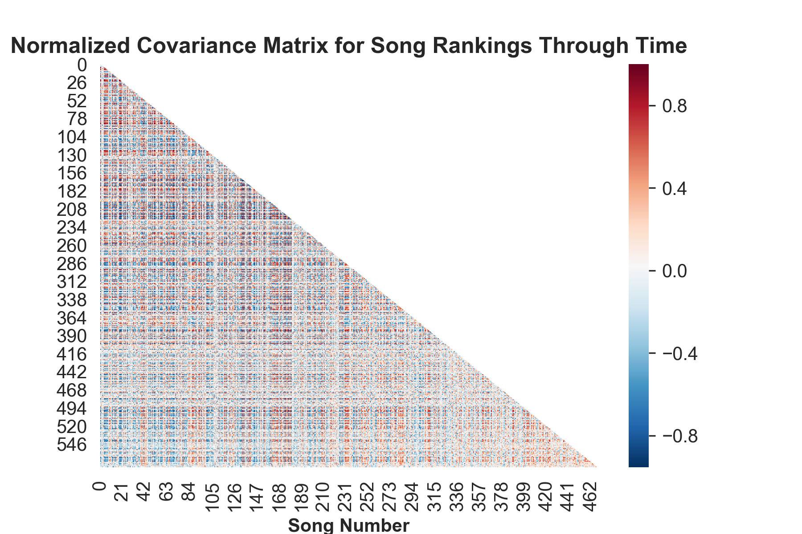

# Fasola Analysis (or FasolAnalysis, if you will)

A bored Sunday becomes some silly data analysis.

For those who are unfamiliar, shape-note signing is an early-American singing communal, hymnody-based singing tradition. Other people have written more eloquently than I will about it, but the long and short of it is that groups of people (sometimes religious, sometimes secular) get together to sing songs from a book full of music, the most popular of which is called The Sacred Harp, which contains 557 songs. Singers join together in a "hollow square", with the four vocal parts singing inwards towards one another, singing just for the joy of singing rather than to practice for a performance. Songs are sight-read or sung from memory, depending on the singer's familiarity with the given tune.

[These data](https://fasola.org/minutes/stats/?c=2018&s=b "Fasola: Historical Song Use") are compiled by the good folks over at fasola.org, who compile minutes from sings all through the world. They say they make the raw data available upon request, but A) I'm only seeing that now and B) I needed practice writing a web-scraper, so I just pulled them directly from the website itself.

This repository is more of a gesture than any sort of real rigorous analysis. Hopefully I'll continue working on it, but I would also encourage others to join me; feel free to send pull requests.

## Files
* **get_data.py** A scraper to pull the relevant data from fasola.org.
* **analysis.py** Some plotting stuff.

## Results
We can plot the popularity of a single song's popularity through the years:

We may also plot the way that several songs have changed over time:

Or we can make a gif of the popularity of a selection of songs through time.

If we really wanna get dorky, we can make a covariance matrix (or really, in this case, a correlation-coefficient matrix) on the songs and their rankings to see which songs move together:

We can then leverage that covariance matrix to see (in theory) which songs move together or opposite, we can simply choose a song and query its column in the covariance matrix. We may then plot, say, the three most- and least-similar songs. For 178 Africa, those look like this:

 

Africa isn't that interesting, though, because it's always bene a popular one, so it just draws other popular ones (unsurprisingly, 276 Bridgewater is its closest partner). So let's look at one that has experienced a lot of variation in time like, say, 472 Akin:

 

In this case, we can see that 440 North Salem and 492 Invocation both grew with Akin, although neither reached quite the heights that Akin has in the last couple years. Africa is still in the mix, I think just because it isn't moving much at all and covariance calculations tend to like that.

On the flip side, we see that 234 Reverential Anthem, 250 Heavenly Vision, and 313t Concord have all been either declining or maintaining a chaotic flat trajectory, in stark contrast to Akin's fast and smooth climb to the top. (A side note: I don't know my history too well but that drop that Heavenly vision takes right around 2010 seems to be right around when Sacred Harp was really hitting its stride in this whole "rebirth" thing. Are Millenials killing anthems now, too?)

What else do you want to know? What else can you see in what I've shown here? I would love to geek out with people over this stuff, so if you see something I missed, please let me know.

## To Do
* If I can get the raw data, geographic stuff would be awesome to play with.
* Any sort of actual analysis: which songs co-vary, which songs have had the most dramatic changes, etc.
* Make the group of songs an object with plotting methods maybe?
* Right now, everything is geared for ranking rather than sing-counts. Make sure things are robust to both.

## Thanks
Thanks to the wonderful people who compile these data and make them freely available for fools like me to poke at.
